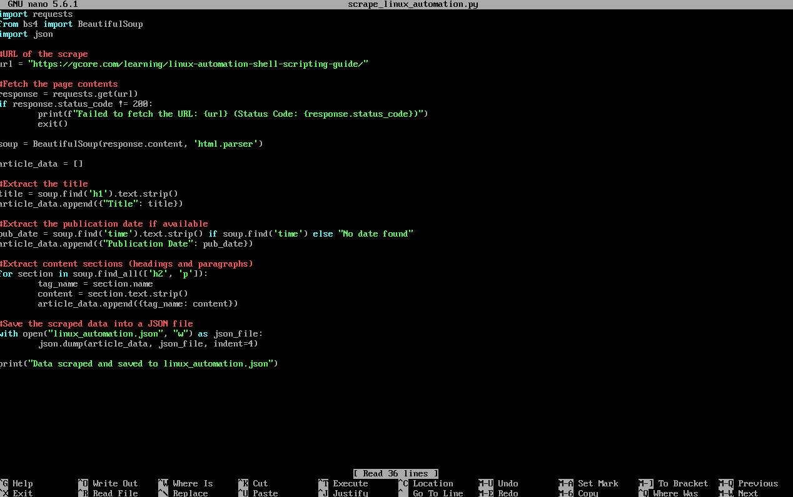
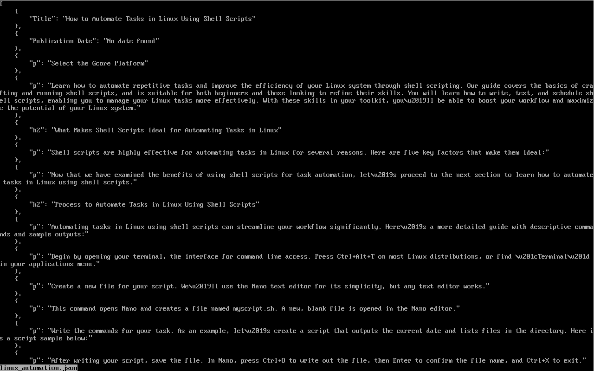
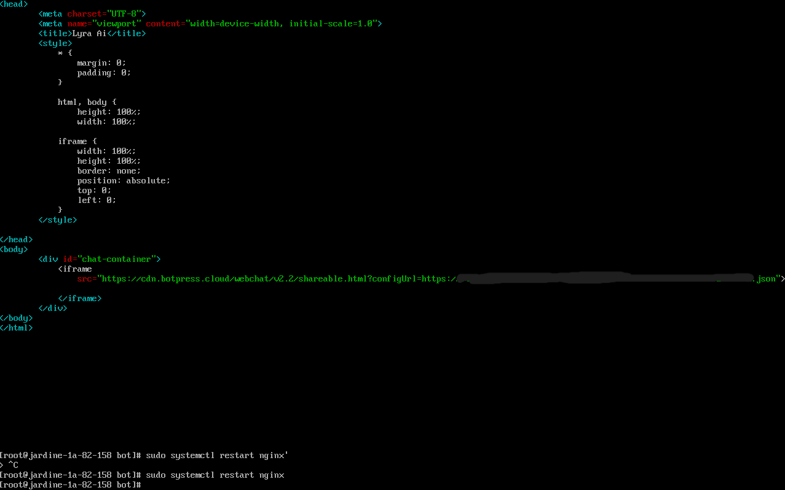

# Custom Botpress Ai Chatbot with Linux and Windows Integration
***Lyra AI***


This project aimed to combine multiple technologies and processes to create and deploy a fully functional chatbot capable of advanced interactions. The goal was to:

**Automate Knowledge Feeding**: Create a data scraper to gather relevant data from external sources and prepare it in a Botpress-compatible format

**Streamline Integration**: Use the Botpress API to seamlessly integrate data into the chatbot without manual uploads

**Cross-Platform Communication**: Establish robust communication between Linux and Windows systems to enable smooth data transfer and testing
Develop a Fully Hosted Solution: Set up a web server (Nginx) to host the chatbot on a Linux machine, ensuring it’s accessible via a browser with a clean and responsive design

The result was a chatbot that not only serves as a responsive interface for user interactions but also leverages dynamic data scraping to stay updated and relevant

Tools used: 
- RHEL 9
- Windows machine with OpenSSH installed
- python3
- pip
- nginx
- wget
- nano
- botpress studio local
- beautifulsoup

## 1.Setting up RHEL Environment  
***Update the system's software packages***  
```bash
#sudo = superuser or root to gain admin privileges

> sudo dnf update -y  
```

***Install Python3 and Pip***  
```bash
> sudo dnf install python3 -y

> sudo dnf install python3-pip -y
```


***Install additional dependencies***  
```bash
> sudo dnf install wget nano curl -y
```

***Install Nginx***  
```bash
> sudo dnf install nginx -y

> sudo systemctl enable nginx

> sudo systemctl start nginx
```

***Ensure firewalls allow HTTP traffic***  
```bash
> sudo firewall-cmd --permanent --add-service=http

> sudo firewall-cmd --reload
```


***On Windows***
1. Enable OpenSSH client:

   - Settings > Apps > Optional Features

   - Install OpenSSH Client

2. Test SSH connection to Linux server
```bash
> ssh root@10.%%%.%%.%%%
```

## 2.Creating the data scraper  
1. Created a python script to scrape content from targeted sites
```bash
> nano linux_automation.py
```
   
```python
import requests
from bs4 import BeautifulSoup
import json

#URL of the target scrape
url = "https://gcore.com/learning/linux-automation-shell-scripting-guide/"

#Fetch the page contents
response = requests.get(url)
if response status_code != 200:
  print(f"Failed to fetch the URL: {url} (Status Code: {response.status_code})")
  exit()

soup = BeautifulSoup(response.content, 'html.parser')

article_data = []

#Extracting the title
title = soup.find('h1').text.strip()
article_data.append({"Title": title})

#Extracting the publication date if available
pub_date = soup.find('time').text.strip() if soup.find('time') else "No date found"
article_data.append({"Publication Date": pub_date})

#Extract content sections (headings and paragraphs)
for section in soup.find_all(['h2', 'p']):
  tag_name = section.name
  content = section.text.strip()
  article_data.append({tag_name: content})

#Saving the scraped data into a JSON file
with open("linux_automation.json:, "w") as json_file:
  json.dump(article_data, json_file, indent=4)

print("Data scraped and saved to linux_automation.json")
``` 


***Run the script***
```bash
> python3 linux_automation.py
```


## 3.Prepping data for botpress  
***Transform the scraped data into a botpress compatible JSON*** 
```bash
> nano transform_to_botpress.py
```
```python
input_file = "linux_automation.json"
output_file = "botpress_content.json"

with open(input_file, "r") as f:
  scraped_data = json.load(f)

botpress_content = []
for i, section in enumerate(scraped_data):
  for tag, text in section.items():
    content_id = f"{tag}_{i}"
    botpress_content.append({
      "type" : "text",
      "id" : content_id,
      "content" : text
    })

#Saving transformed data
with open(output_file, "w") as f:
  json.dump(botpress_content, f, indent = 4)

print(f"Transformed data saved to {output_file}")
```


***Run the script***
```bash
> python3 transform_to_botpress.py
```
***Upload the data to botpress using their API***
```bash
> nano upload_to_botpress.py
```
```python
import requests
botpress_url =  "https://studio.botpress.cloud/api.....
api_token = "bp_pat_............

headers = {
  "Authorization": f"Bearer {api_token}",
  "Content-Type": "application/json"
}

#Load the JSON data
with open("botpress_content.json", "r") as file:
  content_items =- json.load(file)

for item in content_items:
  response = requests.post(botpress_url, headers=headers, json=item)
  if response.statis_code == 200:
    print(f"Uploaded content: {item['id']}")
  else:
    print(f"Failed to upload content: {item['id']}")
    print(f"Error: {response.status_code} - {response.text}")

```


## 4.Hosting the chatbot with nginx
***HTML file for the bot*** 
```bash
> nano /var/www/html/bot/index.html
```
```HTML
<!DOCTYPE html>
<html>
<head>
    <meta charset="UTF-8">
    <meta name="viewport" content="width=device-width, initial-scale=1.0">
    <title>Lyra AI</title>
    <style>
        * {
            margin: 0;
            padding: 0;
        }

        html, body {
            height: 100%;
            width: 100%;
        }

        iframe {
            width: 100%;
            height: 100%;
            border: none;
            position: absolute;
            top: 0;
            left: 0;
        }
    </style>
</head>
<body>
    <div id="chat-container">
        <iframe
            src="https://cdn.botpress.cloud/webchat/v2.2/shareable.html?configUrl=https://files.bpcontent.cloud/2025/01/25/17/20250125175857-VUEMBPRX.json">
        </iframe>
    </div>
</body>
</html>
```


***Updated Nginx configuration***
```bash
> sudo nano /etc/nginx/conf.d/bot.conf
```

```bash
server {
  listen: **;
  server_name 10.%%%.%%.%%%;
  root /var/www/html/bot;
  index index.html;

  location /{
    try_files $uri $uri/ =404;
  }
}
```


***Restart Nginx***
```bash
> sudo systemctl restart ngix
```

***Access online chatbot***
Open browser and visit http://10.%%%.%%.%%%
Non local link: https://cdn.botpress.cloud/webchat/v2.2/shareable.html?configUrl=https://files.bpcontent.cloud/2025/01/25/17/20250125175857-VEEMBPRX.json


